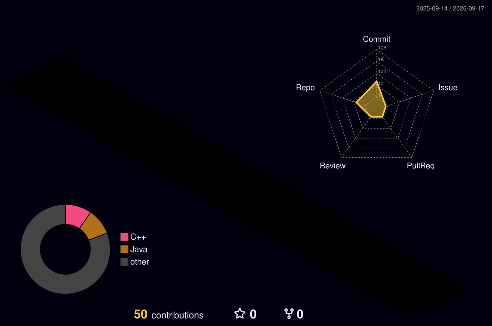

<h1 align="center">你好，我是 ZippedAlo 👋</h1> 
   <em>「<em>纸页微黄，字迹尚新。</em>」</em> 
 
             
  

                   

   
✦ ✦ ✦
  

### 卷一 · 自序

我是一名 `前端 / 后端 / 全栈`（按需修改）工程师，主要做 `你的技术方向` 相关的事。

不太喜欢把简单的事情说复杂，也不太喜欢把复杂的事情藏起来。写代码像整理书架，先分类，再摆放，最后才好看。

- 🔭 在做：`正在进行的项目`
- 🌱 在学：`新技术 / 新语言`
- 💬 想聊：`感兴趣的话题`
- ✍️ 也写：[个人博客](https://your-blog.com/)

### 卷三 · 几件作品

<table>   <tr>     <td width="50%" valign="top">       <b>📖 项目一名称</b>                一句话说清楚：它解决了什么问题，为什么值得看看。                <a href="https://github.com/your-name/repo-one">翻开这一页 →</a>     </td>     <td width="50%" valign="top">       <b>📖 项目二名称</b>                一句话说清楚：它解决了什么问题，为什么值得看看。                <a href="https://github.com/your-name/repo-two">翻开这一页 →</a>     </td>   </tr> </table>

### 卷四 · 一些痕迹

       
 
    
   
✦ ✦ ✦
   
   <em>字写到这里，先歇一歇。谢谢你翻到最后一页。</em> 

## 数据与贡献

